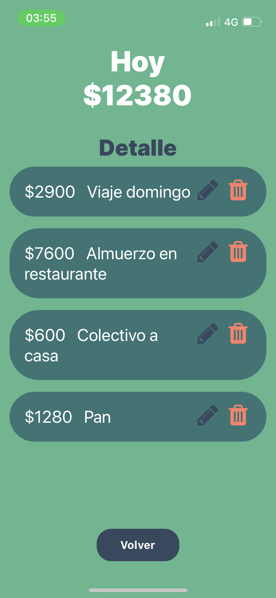

# App gastos hormigas

## Aplicacion movil creada con React Native ⚛️ para llevar registros de los gastos del día a día 





## Requisitos 📝
- nodejs and npm [Nodejs](https://nodejs.org/en/)
- expo-cli [Expo-cli](https://docs.expo.dev/)
- agregar .env en la carpeta raiz con los secretos de  firebase [Firebase](https://console.firebase.google.com/) ej.
```
apiKey=xxxxxxxxxxxxxxxxx
authDomain=xxxxxxxxxxxxxxxxx
projectId=xxxxxxxxxxxxxxxxx
storageBucket=xxxxxxxxxxxxxxxxx
messagingSenderId=xxxxxxxxxxxxxxxxx
appId=1:xxxxxxxxxxxxxxxxx
```


## To run in local 💻
```
npm install --global expo-cli
```
```
cd app-gastos-hormiga
```
```
npm install
```

```
npm start
```
